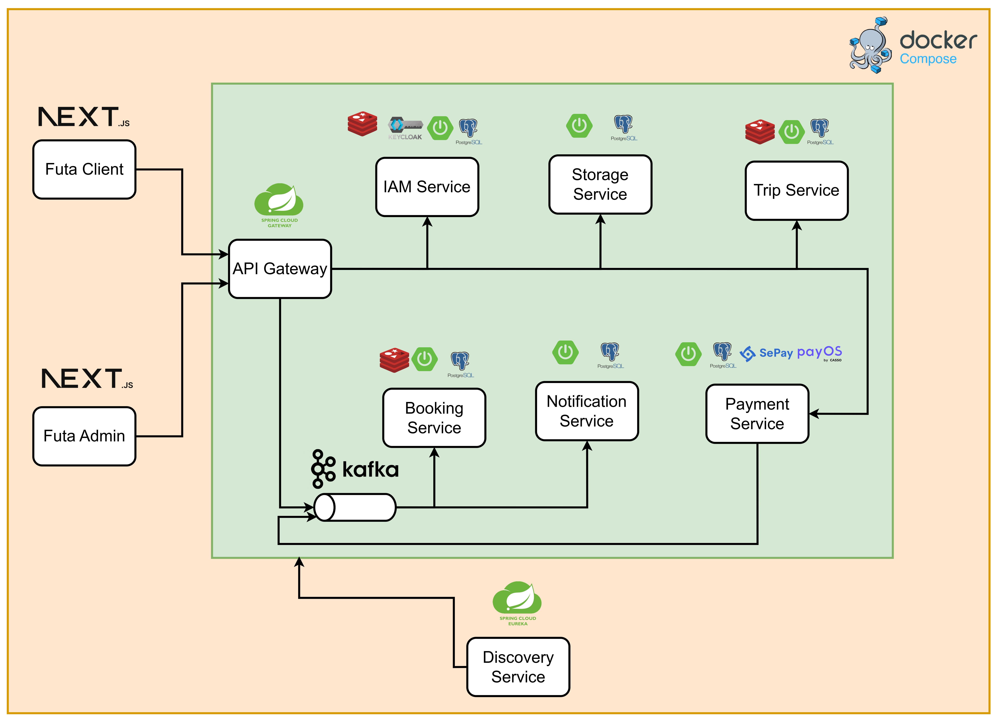

# Futa Bus Lines - Bus Ticket Booking System

This repository contains the backend microservices for the **Futa Bus Lines - Bus Ticket Booking System**, a distributed platform for booking, payment, trip management, notifications, and user management.

## Project Structure

- **ApiGateway/**: API Gateway for routing and authentication.
- **BookingService/**: Handles booking operations and ticket management.
- **Commons/**: Shared libraries (Excel utilities, models, etc.).
- **Data/**: Data initialization and migration scripts.
- **DiscoveryService/**: Service discovery (Eureka/Consul).
- **IamService/**: Identity and Access Management (accounts, roles, permissions).
- **NotificationService/**: Email and notification delivery.
- **PaymentService/**: Wallets, transactions, and payment processing.
- **StorageService/**: File storage and retrieval.
- **TripService/**: Trip, route, and transit point management.

## Technologies

- Java 21+
- Spring Boot (Microservices)
- Spring Cloud (Discovery, Config)
- Spring Security
- MapStruct (DTO mapping)
- Docker & Docker Compose
- Maven

## System Architecture



## Getting Started

### Prerequisites

- Java 21+
- Maven
- Docker & Docker Compose

### Running the Project

1. **Clone the repository:**
   ```sh
   git clone https://github.com/quanndb/Futa-Bus-Lines.git
   cd Futa-Bus-Lines/BackEnd
   ```
